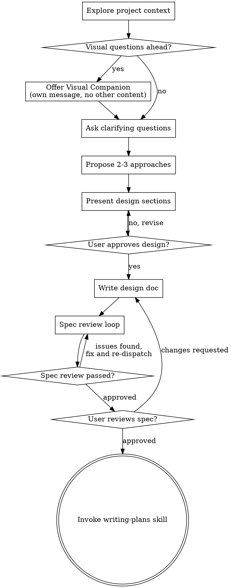

# Brainstorming Ideas Into Designs

Help turn ideas into fully formed designs and specs through natural collaborative dialogue.

Start by understanding the current project context, then ask questions one at a time to refine the idea. Once you understand what you're building, present the design and get user approval.

<HARD-GATE>
Do NOT invoke any implementation skill, write any code, scaffold any project or take any implementation action until you have presented a design and the user has approved it. This applies to EVERY project regardless of perceived simplicity.
</HARD-GATE>

## Anti-Pattern: "This Is Too Simple To Need A Design"

Every project goes through this process. A todo list, a single-function utility, a config change — all of them. "Simple" projects are where unexamined assumptions cause the most wasted work. The design can be short (a few sentences for truly simple projects), but you MUST present it and get approval.

## Trigger Conditions

Activate this skill when:

- User asks to create, design or plan a new feature or project
- User says "brainstorm", "create", "generate", "design", "spec" or "plan"
- User provides a vague idea and asks for structure
- User asks "how would you build this?" before implementation

Do NOT activate when:

- The request is a simple bug fix with clear scope
- The user explicitly asks to skip design and start implementation
- A design doc already exists and the user only wants implementation

## Checklist

You MUST create a task for each of these items and complete them in order:

1. **Explore project context** — check files, docs, recent commits
2. **Offer visual companion** (if topic will involve visual questions) — this is its own message, not combined with a clarifying question. See the Visual Companion section below.
3. **Ask clarifying questions** — one at a time, understand purpose/constraints/success criteria
4. **Propose 2-3 approaches** — with trade-offs and your recommendation
5. **Present design** — in sections scaled to their complexity, get user approval after each section
6. **Write design doc** — save to `docs/specs/YYYY-MM-DD-<topic>-design.md` and commit
7. **Spec review loop** — dispatch spec-document-reviewer subagent with precisely crafted review context (never your session history); fix issues and re-dispatch until approved (max **2 iterations**, then surface to human)
8. **User reviews written spec** — ask user to review the spec file before proceeding
9. **Transition to implementation** — invoke writing-plans skill to create implementation plan

## Exit Criteria

Brainstorming is complete when ALL of the following are true:

1. The user has approved the design (or the design has been iterated to approval)
2. The design doc is written to `docs/specs/`
3. The design doc is committed to git
4. The spec review loop has passed (or was skipped per project size)
5. The user has reviewed the final spec

If the user cannot decide after the full process, see the "Stuck Path" section below.

## Stuck Path

When the user cannot decide after the full brainstorming process:

1. **Identify the blocker** — Ask: "What's making this hard to decide?"
2. **Propose a decision framework** — Offer a weighted scoring matrix for the remaining options
3. **Time-box the decision** — Suggest a 24-hour cool-off period with a written decision log
4. **Default to the recommendation** — If no consensus is reached, recommend the highest-trust option and schedule a retrospective
5. **Escalate to human** — If the blocker is a genuine ambiguity that requires domain expertise outside the scope, surface it to the user

Do NOT proceed to implementation without a decision.

## Process Flow



**The terminal state is invoking writing-plans.** Do NOT invoke frontend-design, mcp-builder or any other implementation skill. The ONLY skill you invoke after brainstorming is writing-plans.

## The Process

**Understanding the idea:**

- Check out the current project state first (files, docs, recent commits)
- Before asking detailed questions, assess scope: if the request describes multiple independent subsystems (e.g. "build a platform with chat, file storage, billing and analytics"), flag this immediately. Don't spend questions refining details of a project that needs to be decomposed first.
- If the project is too large for a single spec, help the user decompose into sub-projects: what are the independent pieces, how do they relate, what order should they be built? Then brainstorm the first sub-project through the normal design flow. Each sub-project gets its own spec → plan → implementation cycle.
- For appropriately-scoped projects, ask questions one at a time to refine the idea
- Prefer multiple choice questions when possible, but open-ended is fine too
- Only one question per message - if a topic needs more exploration, break it into multiple questions
- Focus on understanding: purpose, constraints, success criteria

**Exploring approaches:**

- Propose 2-3 different approaches with trade-offs
- Present options conversationally with your recommendation and reasoning
- Lead with your recommended option and explain why

**Presenting the design:**

- Once you believe you understand what you're building, present the design
- Scale each section to its complexity: a few sentences if straightforward, up to 200-300 words if nuanced
- Ask after each section whether it looks right so far
- Cover: architecture, components, data flow, error handling, testing
- Be ready to go back and clarify if something doesn't make sense

### Handling Design Rejection

If the user rejects the design:

1. Ask what specifically doesn't work — is it the approach, the scope or the details?
2. If the approach is wrong, propose 2-3 alternative approaches (return to step 4)
3. If the scope is wrong, refine the scope (return to step 2)
4. If the details are off, iterate on the specific section without redoing the whole design
5. After 3 full design iterations without approval, suggest a time-boxed experiment instead of another design round

**Design for isolation and clarity:**

- Break the system into smaller units that each have one clear purpose, communicate through well-defined interfaces and can be understood and tested independently
- For each unit, you should be able to answer: what does it do, how do you use it and what does it depend on?
- Can someone understand what a unit does without reading its internals? Can you change the internals without breaking consumers? If not, the boundaries need work.
- Smaller, well-bounded units are also easier for you to work with - you reason better about code you can hold in context at once and your edits are more reliable when files are focused. When a file grows large, that's often a signal that it's doing too much.

**Working in existing codebases:**

- Explore the current structure before proposing changes. Follow existing patterns.
- Where existing code has problems that affect the work (e.g. a file that's grown too large, unclear boundaries, tangled responsibilities), include targeted improvements as part of the design - the way a good developer improves code they're working in.
- Don't propose unrelated refactoring. Stay focused on what serves the current goal.

## After the Design

**Documentation:**

- Write the validated design (spec) to `docs/specs/YYYY-MM-DD-<topic>-design.md`
  - (User preferences for spec location override this default)
- Use elements-of-style:writing-clearly-and-concisely skill if available
- Commit the design document to git

**Spec Review Loop:**
After writing the spec document:

1. Dispatch spec-document-reviewer subagent (see spec-document-reviewer-prompt.md)
2. If Issues Found: fix, re-dispatch, repeat until Approved
3. If loop exceeds 2 iterations, surface to human for guidance

**User Review Gate:**
After the spec review loop passes, ask the user to review the written spec before proceeding:

> "Spec written and committed to `<path>`. Please review it and let me know if you want to make any changes before we start writing out the implementation plan."

Wait for the user's response. If they request changes, make them and re-run the spec review loop. Only proceed once the user approves.

**Implementation:**

- Invoke the writing-plans skill to create a detailed implementation plan
- Do NOT invoke any other skill. writing-plans is the next step.

## Key Principles

- **One question at a time** — Don't overwhelm with multiple questions
- **Multiple choice preferred** — Easier to answer than open-ended when possible
- **YAGNI ruthlessly** — Remove unnecessary features from all designs
- **Explore alternatives** — Always propose 2-3 approaches before settling
- **Incremental validation** — Present design, get approval before moving on
- **Be flexible** — Go back and clarify when something doesn't make sense

## Failure Modes

| Symptom | Likely Cause | Fix |
|---------|-------------|-----|
| User keeps asking more questions instead of deciding | Scope creep or unclear priorities | Return to step 3, ask for priority ranking |
| User approves design but then changes mind during implementation | Design wasn't validated enough | Strengthen the user review gate (step 8) |
| Agent writes code without design approval | Hard-gate not enforced | Re-read HARD-GATE section; restart at step 1 |
| Spec review loop exceeds 2 iterations | Spec is fundamentally misaligned with project | Run a focused redesign session on the contested sections |

## Example Design Doc

```markdown
# 2026-07-30 User Onboarding Flow — Design

## Purpose

Reduce new-user time-to-first-action from 14 minutes to under 5 minutes.

## Scope

This covers the signup-to-first-upload flow only. Billing and settings are out of scope.

## Architecture

- **Step 1: Signup** — Email + password (no OAuth to reduce choices)
- **Step 2: Onboarding wizard** — 3 screens: import source, template pick, destination
- **Step 3: First action** — Guided upload with progress indicator
- **Step 4: Celebration** — Confirmation screen with next steps

## Components

| Component | Purpose | Interface |
|-----------|---------|-----------|
| `OnboardingWizard` | Manages wizard state | `next()`, `back()`, `skip()` |
| `UploadGuide` | Step-by-step upload flow | `start()`, `onProgress()`, `onComplete()` |

## Data Flow

User signup → wizard state created → upload initiated → confirmation logged

## Error Handling

- Upload failure: retry button with persistent state
- Wizard abandonment: save state for 7 days, resume on return
- Timeout (no action in 5 min): soft nudge, not a blocker

## Testing

- Unit: wizard state transitions (happy path + all abort paths)
- Integration: full signup-to-upload flow with mocked upload service
- E2E: real signup, real upload, real confirmation

## Tradeoffs Considered

| Option | Selected? | Why |
|--------|-----------|-----|
| OAuth signup | No | Adds 3 extra clicks; 14% drop-off in prototypes |
| 5-step wizard | No | Too many screens; chose 3 |
| Auto-upload default | No | Surprising to users; explicit is safer |
```

## Design for Clarity

A good design doc should be understandable by a new team member in under 10 minutes. Every section should answer: what is this, why does it matter and how do I implement it?

## Cross-Skill References

- **writing-plans** — Next step after brainstorming completes (invoked automatically at step 9)
- **docs-write** — For writing the design doc if `elements-of-style:writing-clearly-and-concisely` isn't available
- **ai-self-reflection** — For post-implementation retro on the brainstorming process itself
- **code-quality** — Run before transitioning to implementation to ensure design docs are clean

## Visual Companion

A browser-based companion for showing mockups, diagrams and visual options during brainstorming. Available as a tool — not a mode. Accepting the companion means it's available for questions that benefit from visual treatment; it does NOT mean every question goes through the browser.

**Offering the companion:** When you anticipate that upcoming questions will involve visual content (mockups, layouts, diagrams), offer it once for consent:
> "Some of what we're working on might be easier to explain if I can show it to you in a web browser. I can put together mockups, diagrams, comparisons and other visuals as we go. This feature is still new and can be token-intensive. Want to try it? (Requires opening a local URL)"

**This offer MUST be its own message.** Do not combine it with clarifying questions, context summaries or any other content. The message should contain ONLY the offer above and nothing else. Wait for the user's response before continuing. If they decline, proceed with text-only brainstorming.

**Per-question decision:** Even after the user accepts, decide FOR EACH QUESTION whether to use the browser or the terminal. The test: **would the user understand this better by seeing it than reading it?**

- **Use the browser** for content that IS visual — mockups, wireframes, layout comparisons, architecture diagrams, side-by-side visual designs
- **Use the terminal** for content that is text — requirements questions, conceptual choices, tradeoff lists, A/B/C/D text options, scope decisions

A question about a UI topic is not automatically a visual question. "What does personality mean in this context?" is a conceptual question — use the terminal. "Which wizard layout works better?" is a visual question — use the browser.

The visual companion is optional. Setup instructions are in `scripts/` (start-server.sh, helper.js, frame-template.html). Only use it when a question truly benefits from seeing rather than reading.
